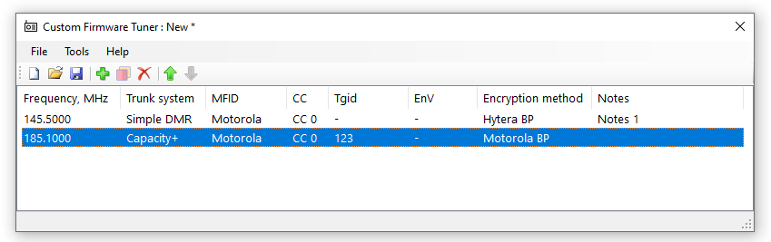
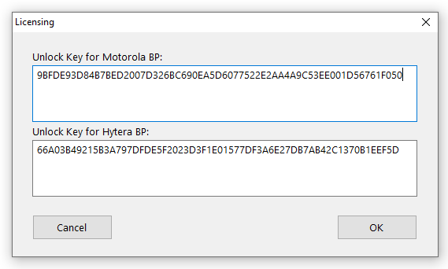
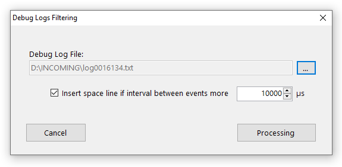
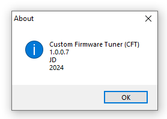
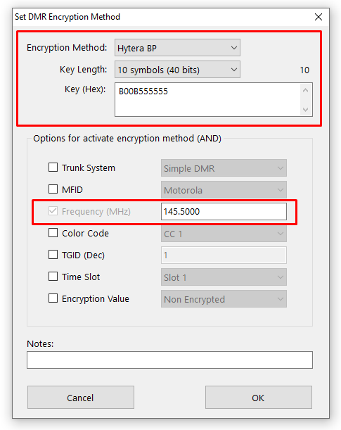
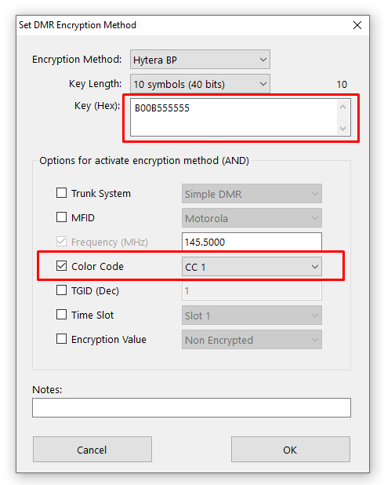
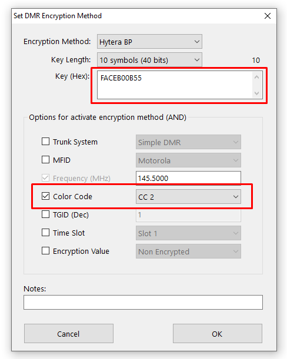
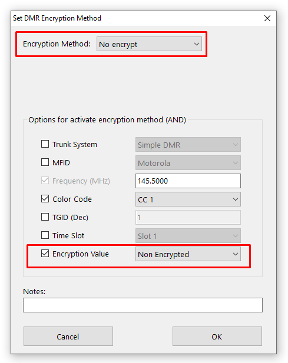

# How To Use

## The Graphical User Interface of the CFT Program

The CFT program allows you to enter decryption keys to specific frequencies. Saving these settings creates the **alice.cft** file. Do not change this file's name when saving it to the scanner. Place **alice.cft** in the root directory "\\" of the Scanner's memory card (for example, E:\\).

**Make sure to backup your alice.cft file from time to time as it contains important data & your purchased License Key(s).** You can do so by manually creating a copy of the **alice.cft** file and naming it meaningfully, such as "alice - Backup 20240229.cft". Save it locally on your computer or in the cloud. To use that backup later, if needed, rename it back to **alice.cft** and copy it to the root of the scanner's memory card.

The upper ribbon and icons of the CFT program are quite self explanatory. 
Create a New setting by going to File > New, or by clicking on the .
Open an already saved file by going to File > Open..., or by clicking on the .
Make sure to Save your file from time to time, by going to File > Save or Save As..., or by clicking on the .
You may have issues Saving the file to your Documents directory, so Save it to a different location such as Downloads.
You will be prompted to Save your work when Exiting.

To Add a line to the alice.cft file click on the .
To Duplicate an existing line, including all its data, select that line and click on the .
To Delete an existing line, select that line and click on the . Note that this action is irreversible.

To Sort the lines according to their frequency, click on the "Frequency, MHz" column title.
To manually move a line up or down, select that line and click on the  or .

Tools > Licensing... enables you to enter the License Key(s) you have purchased. Make sure to press OK after pasting the long License text.

Tools > Debug Logs Filtering enables you to view the debug logs in a filtered manner. This option is for advanced users only.

The Help menu contains the version number.

Make sure to use the latest version.

The parameters that you enter for each entry will be reflected in the main table view. Unmarked values will be denoted by "-".

Each entry has an optional Notes field that is there for your convenience. It is not taken into account in the decryption process nor saved to the scanner.

## Creating DMR Encryption Method row

Initially it is assumed that you have an encryption key, you know what encryption algorithm it is designed for and what frequency the radio is transmitting on.

Try to minimize the number of parameters you select.

If you have selected a value, it must be present when transmitting the digitalsignal is received, if it is not, the method with these parameters will not be used by the firmware.

Sorting the rows in the list for complex cases is important.

The screenshots may differ for different versions of CFT but the meaning is the same.

### General case

It's simple. We choose the values that we initially know. In this case, we have one known frequency on which all radio transmissions are protected by one encryption key.

### General but more complex case

This and the other more complex cases are similar. We must select the conditions under which the right encryption key is chosen.

Suppose we have one frequency on which radio stations with different color codes work. The stations that work with CC1 have the encryption key B00B555555 and CC2 has the encryption key FACEB00B55, for example. 

In this case we have to create two data rows where we have the same frequency but different encryption keys and color codes.

### Special case

Suppose that there are many broadcasts that are encrypted with a key but one of the radio station does not have a key and the broadcast is not encrypted. For this purpose, when selecting Encryption Method, the value is "No encrypt".  You must also select "Non Encrypted" in the Encryption Value field

### Unprocessed cases

There are cases when some transmission streams are encrypted but the received signals do not contain the encryption internal flag in the data, or that an encryption flag is present in the stream but the transmission is not really encrypted. In general, the current set of parameters does not allow processing of such cases, and the voices might sound garbled.

