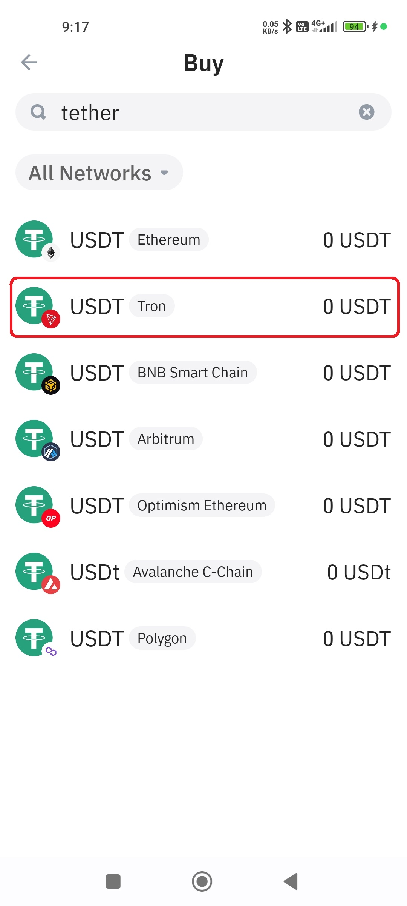
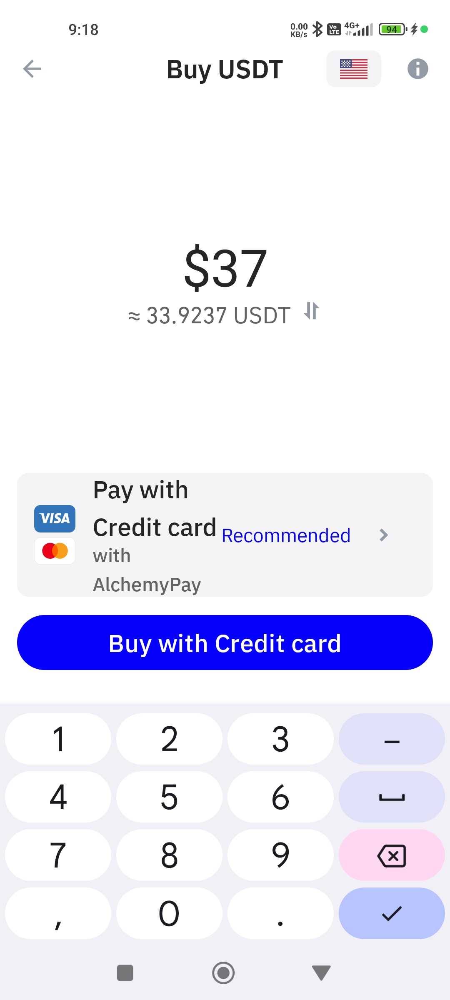
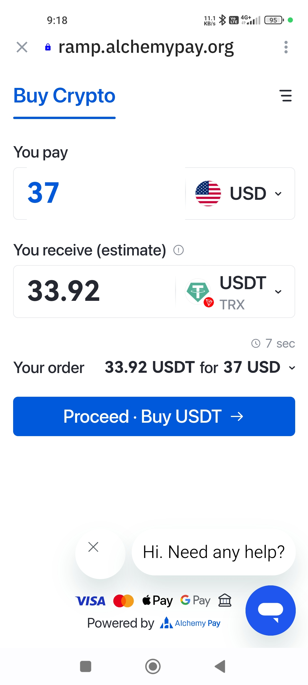
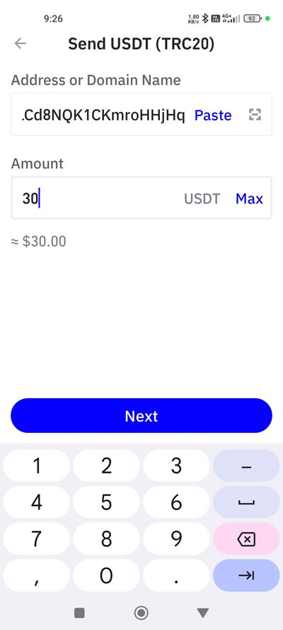
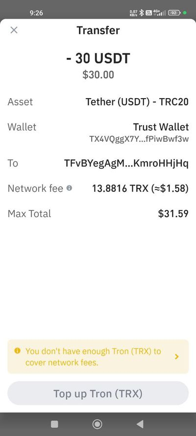
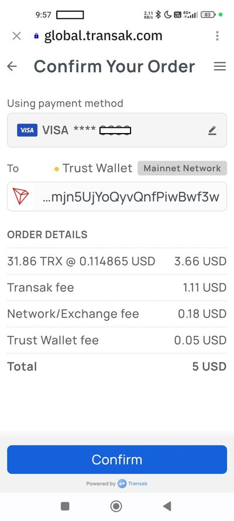
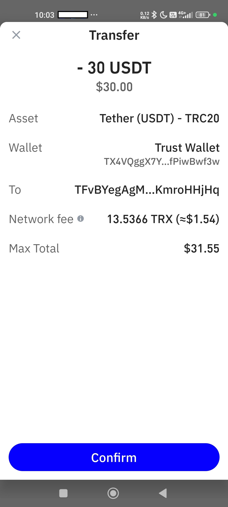
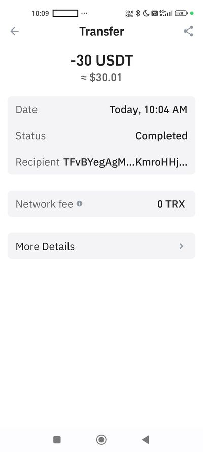

# How to buy the License(s) with Cryptocurrency.

#### Prerequisites:

You will need time (less than half an hour in most cases), **a lot of patience**, some money (about $42 - $64 USD) in one or more of your Credit card/Debit card/Bank account/GooglePay/Cash App, a smartphone, and probably also some official ID to confirm your identity (such as driver's license or passport, and a smartphone with camera for a selfie pic).

The phases we will take are:
* A. **Downloading and setting up** the **Trust Wallet** app; 
* B. **Buying Tether USDT Tron**; 
* C. **Buying** Tron **TRX**; 
* D. **Sending** the **USDT Tron** with the help of the **TRX** to buy the license(s).

Optionally, you can also watch a video at https://www.youtube.com/watch?v=jBCXf8yylQA to get an idea about the first phase of the process.

**The following steps are described for convenience only. They will help you purchase the License(s) for the CFT program, but may vary from country to country or by payment methods.**

**1.** Download and install the mobile app by visiting https://trustwallet.com/ or by going to the Phone's Store and searching for "Trust: Crypto & Bitcoin Wallet" from [DApps Platform, Inc](https://play.google.com/store/apps/developer?id=DApps+Platform,+Inc.) (Android).

**2.** Create a New Wallet (if you do not have an existing one) and use the method to Backup to Google Drive. You will have to select your relevant Gmail account and approve the permissions. Select a strong password to protect your Google Drive Wallet Backup and mark the Vs to confirm.

**3.** Create a pin code, and use your fingerprint for extra protection.

**4.** To send the funds you will first need to **Buy** them. Press the Buy button. You will be prompted to Proceed anyway or optionally, Backup your funds. You can press Proceed anyway, or backup by pressing the "Back up your secret phrase" button  >  Google Drive active >  Verify Backup > Enter your password from step 2. 
No need to do so all the time.

In the Buy screen search for "tether". 
Select **USDT Tron** from that list.

**5.** Enter the amount you would like to Buy.

The exchange rate of the Tether USDT is about the same as the official US Dollar, but please note that **during the Buying & Sending processes there are fees/commissions of 10% to 20% for each action.**
**Make sure to buy enough USDT Tron so eventually you send the right sum for the License(s).**
For example, one license of $30USD will require you to pay about **$37USD**, and two licenses will require you to pay about **$59USD** (the larger the sums, the lesser the fees/commissions).
In these examples, after this process is done you should have about 33 Tether USDT and about 55 Tether USDT to continue with the Send process.
Note that if you use a different currency than US Dollars, the rates would probably be worse and you will have to Buy much more than 20% more from the required amount in Tether USDT. In anycase, if you buy with something other than your local currency the credit card company will probably also take fees/commissions.

**Note that these sums are for the Tether USDT Tron phase. The Tron TRX phase will require much lower sums, but that will be explained in step 11.**

**6.** Select the Payment method below (Credit Card/Google Pay/Digital Wallet/Bank Transfer). The default one is supposed to give you the best value for your money, but make sure anyway. Perhaps a different method is better for you and has a good exchange rate, nonetheless.
Note that not all the credit card companies are accepted.

**7.** Press the Buy button below and you will be forwarded to the Payment Platform site. You will have to enter your email and approve the Terms.
Enter the verification code you got by email. (**Check your Spam box**. It might be there).
Depending on the company you buy from, you might need to verify your identity. That process takes a couple of minutes and requires an official local ID and selfie pic.

**8.** Confirm the method of payment and enter the relevant (card/bank etc.) details in the screen of the purchase company.
Press Confirm.
Depending on your payment method you may need to perform another confirmation of the purchase via email/text/screen, or you might even need to confirm your identity by filling out your personal details and taking pics of your official ID and selfie.

**9.** You now have obtained the Tether USDT Tron. And it will appear in your Trust Wallet.
Now we need to Send it.
Press the Send button.
You will be prompted to Proceed anyway or optionally, Backup your funds. You can press Proceed anyway, or backup by pressing the "Back up your secret phrase" button  >  Google Drive active >  Verify Backup > Enter your password from step 2. No need to do so all the time.

**10.** In the Send screen, select the Tether USDT Tron currency. You will now be asked to fill out the address to send it to.
In the Address or Domain Name field, you can use the barcode/camera icon to scan the Wallet's Q-code 

or copy the long address and paste it

**TFvBYegAgMR5c5CtLCd8NQK1CKmroHHjHq**

Enter the amount 30 or 50 USDT. (By now you already have more than 30 or 50 to cover additional fees/commissions).

Press Next.

**11.** If this is your first time, you are probably lacking Tron TRX, the "fee" that "enables" the sending process.
Note the sum that you are lacking. It is probably about 2 - 4 TRX.

So you will have to purchase some TRX.
Press the orange prompt "You do not have enough Tron (TRX) to cover network fees". and you will be forwarded to buy Tron TRX.

**12.** We will need to buy at least $5USD of Tron TRX to cover the transfer and fees/commissions.
Because we are purchasing such a small amount, the options will be very limited and expensive.
The process will probably include entering your complete details (email+email verification - check Spam box, name, full address) and verifying your ID with an official ID and selfie. If and when you are asked about your identity, they may also ask why you are buying the crypto. We can answer by way of elimination: We are not going to trade with it, and we are not going to buy NFT. So the answer that is left is for dApps, or something like that. This process takes a couple of minutes.

At the end you will be able to purchase the TRX, probably with a credit card.

**13.** Approve the TRX purchase and "transfer" them to your wallet.

**14.** By now you have in your wallet: Tether USDT (Tron) and Tron (TRX). You can complete the Sending of the currency.

**15.** Press Send.
You will be prompted to Proceed anyway or optionally, Backup your funds. You can press Proceed anyway, or backup by pressing the "Back up your secret phrase" button  >  Google Drive active >  Verify Backup > Enter your password from step 2. No need to do so all the time.
Make sure to enter the correct Wallet/Address.
In the Address or Domain Name field, you can use the barcode/camera icon to scan the Wallet's Q-code 

or copy the long address and paste it

**TFvBYegAgMR5c5CtLCd8NQK1CKmroHHjHq**

Enter the amount 30 or 50 USDT according to the License(s) you are purchasing. (By now you already have more than 30 or 50 to cover additional fees/commissions + you have the TRX).
Press Next.

**16.** The cryptocurrency is on the way to its destination. After a minute or two of "Pending" you will get confirmation that the transaction has been Completed.

**17.** Please inform JD about the transfer via email.
