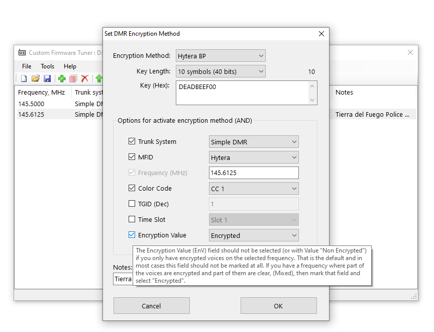
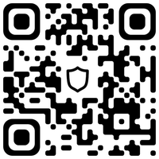

# CFT - Custom Firmware Tuner for Uniden Scanners

### Purpose

The main purpose of CFT is to select the parameters of digital protocols that will activate the decryption of encrypted voice traffic. 

Please read the instructions about [How To Get Started with CFT v1](HOWTO.md).

Video tutorial: [How strart to using the OpenScanner Custom Firmware for Uniden Scanners](https://www.youtube.com/watch?v=alfvpBevngc)

### Supported scanner models

* Uniden BCD436HP with [CF 1.99.23](https://github.com/x27/openscanner/releases/tag/v1.99.23)
* Uniden BCD536HP with [CF 1.99.23](https://github.com/x27/openscanner/releases/tag/v1.99.23)
* Uniden SDS100 with [CF 1.99.23](https://github.com/x27/openscanner/releases/tag/v1.99.23)
* Uniden UBCD3600XLT with [CF 1.99.24](https://github.com/x27/openscanner/releases/tag/v1.99.23)
* Uniden SDS100E with [CF 1.99.23](https://github.com/x27/openscanner/releases/tag/v1.99.23)
* Uniden SDS200 with [CF 1.99.23](https://github.com/x27/openscanner/releases/tag/v1.99.23)
* Uniden SDS200E with [CF 1.99.23](https://github.com/x27/openscanner/releases/tag/v1.99.23)
* Uniden UBCD436PT with [CF 1.99.23](https://github.com/x27/openscanner/releases/tag/v1.99.23)
* Uniden USDS100 with [CF 1.99.23](https://github.com/x27/openscanner/releases/tag/v1.99.23)
* Uniden UBCD536PT with [CF 1.99.23](https://github.com/x27/openscanner/releases/tag/v1.99.23)

### Supported decryption protocols

* Hytera BP (Basic Privacy), CF v1.99.11 and above
    * 10 characters (40 bits) - confirmed
    * 10 characters (40 bits) with OTA Encryption - confirmed
    * 32 characters (128 bits) - confirmed
    * 64 characters (256 bits) - confirmed
    * 64 characters (256 bits) with OTA Encryption - confirmed
* Motorola BP (Basic Privacy), CF v1.99.11 and above
   * key 1-255 - confirmed
   * key 1-255 Mixed with Clear voice - confirmed
* Motorola EP (Enhanced Privacy), CF v1.99.16 (test) and above
   * key 40 bit - confirmed
* NXDN Scrambler, CF v1.99.14 (test) and above
   * key 1-32766 - confirmed
* Anytone Common Encryption, CF v1.99.18 (test)
   * key 1-65535 - test
* P25 Phase1 ADP, CF v1.99.20 (test) and above
   * key 10 characters (40 bits) - confirmed 
* P25 DES OFB, CF v1.99.23 and anove
   * key 16 characters (56 bits + 8 bits parity) - confirmed
* Tytera EP, CF v1.99.25 and above
   * key 32 characters (128 bits) - test    

### About Encryption Key

> [!IMPORTANT]
> **Custom Firmware will not find the Encryption Key. It is something that needs to be obtained in other ways.**

### Download 

The last executable version for Windows you can download [HERE](https://github.com/x27/CFT/releases/latest), placed in the file **CFT.zip**

### Supported scanner modes

* Direct freq entry - confirmed
* Custom Search - confirmed
* Close Call - confirmed
* Quick Search - confirmed
* Memory Scan as a Conventional - confirmed
* Memory Scan as a Digital - confirmed

### Supported trunking modes DMR

* Conventional repeater (Hytera/Motorola) - confirmed
* CAP+ - confirmed
* Connect+ - confirmed
* DMR Tier III (Motorola CapMax/Hytera/other ETSI compatible) - confirmed

### Prerequisites

Requires an installed paid [DMR upgrade](https://info.uniden.com/twiki/bin/view/UnidenMan4/DigitalMobileRadioUpgrade) on the scanner for Motorola BP, Motorola EP or Hytera BP.

Requires an installed paid [NXDN upgrade](https://info.uniden.com/twiki/bin/view/UnidenMan4/DigitalMobileRadioUpgrade) on the scanner for NXDN Scrambler.

Requires an installed Custom Firmware (CF) on your scanner.

OS: Windows XP or higher with installed .Net Framework 2.0

### Debug Logs

If you have any problems with signal decryption (or some other problem with my firmware ) and can't figure it out, you need to create debug files and send it to my email.

Separate debug files for each problem separately.

How to create the debug logs:
* Enable logging.
   - Enable logging by pressing the side Menu button > Settings > Set Debug Log Mode > SD Card (File). Select by pressing on the Volume button.
* Include multiple calls together with pauses.
* Disable logging.
   - Deactivate debug logging via the scanner menu Settings > Set Debug Logs Mode > Off. 
* Send Email with problem's description and attached logs.
   - Debug logs can be found on the scanner SD Card in the /BCDx36HP/debug/ directory. 

[More about Debug Logs](DEBUG.md)

### Virus/Trojan false warning

Some Windows users are triggered by the built-in antivirus when working with the file "alice.cft". This warning is false, which you can verify by checking this file with [VirusTotal](https://www.virustotal.com/gui/home/upload), an online service that combines a huge number of antivirus checks.

### Demo Limitations

* Session time limit - **2 minutes** of decrypted voice of any protocols (then turn Off and On device, up to a total of **2 hours**)
* Key limit - **5 pcs**

If you are not satisfied with the limitations of the demo mode, you can purchase unlock keys for the protocol you need. Each unlock key is unique per the Scanner's ESN.

### Donation / Payments

If your scanner model is not supported, but you want to enjoy these features, or you just want to support the project, you are more than welcome to donate or purchase unlock keys.
But before you do, write me an e-mail.

Licenses for unlocking **Hytera BP**, **Motorola BP**, **Motorola EP**, **NXDN Scrambler**, **ADP**, **P25 DES** keys are currently available. 

**Anytone Common Encryption**, **Tytera EP**  are free for users who have purchased paid licenses.

For obvious reasons, I would like to remain anonymous, so payments are only accepted in cryptocurrency or via intermediary's PayPal

#### Crypto payment

Each license costs $30USD. 

Tether (USDT) TRC20

TFvBYegAgMR5c5CtLCd8NQK1CKmroHHjHq

If you don't know what it is try starting here [TrustWallet](https://trustwallet.com/)

Big [How to buy the License(s) with Cryptocurrency](HOWTOCRYPTO.md) with images from well-wisher

#### Payment via Paypal (through an intermediary)

Each license costs $40USD.

To receive the Paypal payment address, please first write to me an email and I will give it to you.

In your e-mail, please specify the serial number of the scanner and which license(s) you want to buy.

> [!CAUTION]
> **Please do not include the shipping address when paying via Paypal as the license is a digital service.**

### Support

Any suggestions, wishes, advice, feedback - email me.

You can also ask your questions or discuss issues with the users' community in the [Telegram chat](https://t.me/+lBpGtQr1FgI0ZWU6) or in the discussion under any post in the [Telegram channel](https://t.me/openscanner)

### Links

* email: n3617400@yahoo.com
* twitter: https://x.com/openscanner
* telegram channel: https://t.me/openscanner
* telegram chat: https://t.me/openscannerchat

