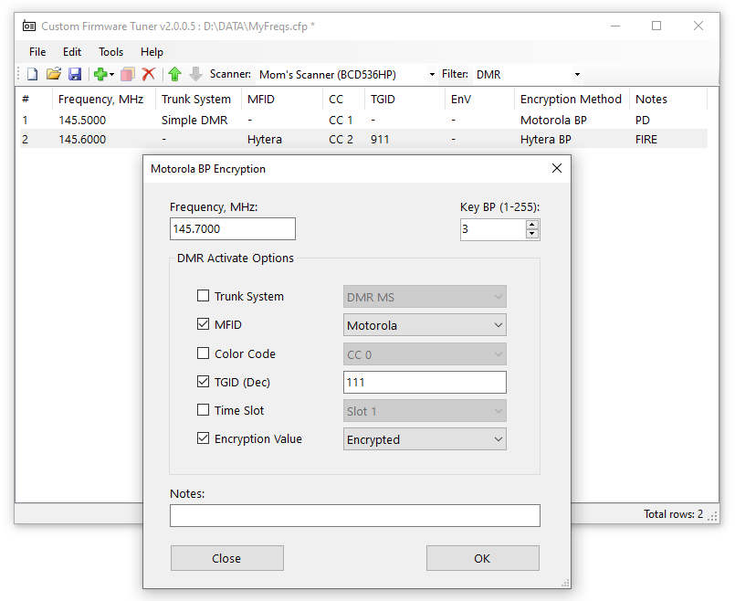

# CFT - Custom Firmware Tuner for Uniden BCD436HP

### Purpose

The main purpose of CFT is to select the parameters of digital protocols that will activate the decryption of encrypted voice traffic. 

The software is developed to work with Custom Firmware (CF) starting from v1.99.08

The settings must be saved in the file "alice.cft". Place this file at the root directory "\\" of the Scanner's memory card (for example, E:\\).

### Supported decryption protocols

* Hytera BP (Basic Privacy)
    * 10 characters (40 bits) - confirmed
    * 10 characters (40 bits) with OTA Encryption - confirmed
    * 32 characters (128 bits) - confirmed
    * 64 characters (256 bits) - not confirmed
* Motorola BP (Basic Privacy) key 1-255 - confirmed
* Motorola BP (Basic Privacy) key 1-255 Mixed with Clear voice - confirmed
* RC4 - comming soon

### Supported scanner models

* Uniden BCD436HP with [CF 1.99.09](https://github.com/x27/openscanner/releases/tag/BCD436HP_1.99.09)
* Uniden BCD536HP coming soon
* Uniden SDS100 soon maybe (23% of funds raised)
* Uniden SDS200 soon maybe (0% of funds raised)
* Uniden UBCD3600XLT soon maybe (0% of funds raised)

### Supported scanner modes

* Direct freq entry - confirmed
* Custom Search - confirmed
* Close Call - confirmed
* Quick Search - confirmed
* Memory Scan as a Conventional - confirmed
* Memory Scan as a Digital - not confirmed, [bug](https://github.com/x27/CFT/issues/3)

## Supported trunking modes

* Conventional repeater - confirmed
* CAP+ - no data
* Connect+ - no data
* TIII - no data

### About Encryption Key

Custom Firmware will not find the Encryption Key. It is something that needs to be obtained in other ways.

### Debug Logs

If you have any problems with signal decryption (or some other problem with my firmware ) and can't figure it out, you need to create debug files and send it to my email.

Separate debug files for each problem separately.

How to create the debug logs:
* Enable logging.
   - Enable logging by pressing the side Menu button > Settings > Set Debug Log Mode > SD Card (File). Select by pressing on the Volume button.
* Include multiple calls together with pauses.
* Disable logging.
   - Deactivate debug logging via the scanner menu Settings > Set Debug Logs Mode > Off.        
* Send Email with problem's description and attached logs.
   - Debug logs can be found on the scanner SD Card in the /BCDx36HP/debug/ directory.   

[More about Debug Logs](DEBUG.md)

### Demo Limitations

* Time limit - 2 minutes of decrypted voice of any protocols. Reboot the scanner for reset limitation.
* Key limit - 5 pcs

If you are not satisfied with the limitations of the demo mode, you can purchase unlock keys for the protocol you need. Each unlock key is unique per the Scanner's ESN.

### Donation / Payments

If your scanner model is not supported, but you want to enjoy these features, or you just want to support the project, you are more than welcome to donate or purchase unlock keys.
But before you do, write me an e-mail.

Licenses for unlocking Hytera BP and Motorola BP keys are currently available. Each license costs 30USD, a pair of licenses - 50USD. 

For obvious reasons, I would like to remain anonymous, so payments are only accepted in cryptocurrency

Tether (USDT) TRC20

TFvBYegAgMR5c5CtLCd8NQK1CKmroHHjHq

If you don't know what it is try starting here [TrustWallet](https://trustwallet.com/)

### Support

Any suggestions, wishes, advice, feedback - email me.

### Links

* email: n3617400@yahoo.com
* twitter: https://x.com/openscanner
* telegram: https://t.me/openscanner

